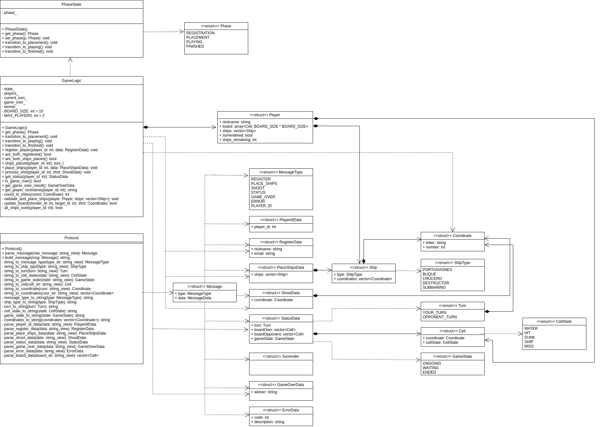

# Battle Ship Protocol
### Table of Contents
- [1. Introduction](#1-Introduction)
  - [1.1 Purpose](#11-Purpose)
  - [1.2 Requiremets](#12-Requirements)
- [2. Notational Conventions and Generic Grammar](#2-Notational Conventions and Generic Grammar)
  - [2.1 Backus-Naur Form (BNF) ](#21-Backus-Naur Form (BNF)) 
  - [2.2 Protocol Message Examples ](#21-Protocol Message Examples) 
- [3. System Diagrams](#3-System Diagrams)
  - [3.1 UML Class Diagram](#31-UML Class Diagram)

## Introduction
### 1.1 Purpose
The BattleShipProtocol is an application-layer communication protocol specifically designed for real-time, turn-based multiplayer games. It enables interaction between clients and a central game server, facilitating the synchronization of state, player actions, and game events in a networked version of the classic Battleship game. The protocol is built over TCP/IP using the Berkeley Sockets API, ensuring reliable message delivery and concurrency support for multiple simultaneous game sessions.

BattleShipProtocol is a text-based protocol that supports a structured and extensible set of message types and rules for game control. It allows for clear separation between user input and game logic, empowering independent development of client and server components. Key features of the protocol include message typing, data validation, session management, and game state broadcasting to ensure fairness and consistency between players.

BattleShipProtocol is currently implemented in C++ for the server and compatible with client applications developed in any language supporting the Berkeley Sockets interface.

### 1.2 Requirements
For a detailed overview of the functional and non-functional requirements of this project, please refer to the project's backlog. It contains the full specification of features, user stories, and technical considerations.

🔗 [Click here to view the project backlog](https://github.com/users/samuelAriza/projects/4)

## 2. Notational Conventions and Generic Grammar
### 2.1 Backus-Naur Form (BNF)
The following BNF (Backus-Naur Form) defines the formal grammar for the communication protocol used in the client-server interaction of the Battleship game. This protocol is designed to ensure strict syntactic and semantic consistency across all message exchanges, enabling reliable parsing, validation, and processing of game-related instructions and states.

The BNF grammar below specifies all valid message types, their corresponding payloads, and the permissible structure and constraints of each component, including nicknames, coordinates, board states, and error reporting formats.

    <message> ::= <message-type> "|" <message-data>
    <message-type> ::= "REGISTER" | "PLACE_SHIPS" | "SHOOT" | "STATUS" | "SURRENDER" | "GAME_OVER" | "ERROR" 
    <message-data> ::= <register-data> | <place-ships-data> | <shoot-data> | <status-data> | <surrender-data> | <game-over-data> | <error-data> 
    <register-data> ::= <nickname> "," <email> 
    <nickname> ::= <string> 
    <email> ::= <string> "@" <string> "." <string> 
    <place-ships-data> ::= <ship-list> 
    <ship-list> ::= <ship> | <ship> ";" <ship-list> 
    <ship> ::= <ship-type> ":" <coordinates> 
    <ship-type> ::= "PORTAAVIONES" | "BUQUE" | "CRUCERO" | "DESTRUCTOR" | "SUBMARINO" 
    <coordinates> ::= <coord>  | <coord> "," <coordinates> ","  
    <coord> ::= <letter><number> 
    <letter> ::= "A" | "B" | "C" | "D" | "E" | "F" | "G" | "H" | "I" | "J" 
    <number> ::= "1" | "2" | "3" | "4" | "5" | "6" | "7" | "8" | "9" | "10" 
    <shoot-data> ::= <coord>
    <status-data> ::= <turn> ";" <board-own> ";" <board-opponent> ";" <game-state> 
    <turn> ::= "YOUR_TURN" | "OPPONENT_TURN" 
    <board-own> ::= <cell-list> 
    <board-opponent> ::= <cell-list> 
    <cell-list> ::= <cell> | <cell> "," <cell-list> 
    <cell> ::= <coord> ":" <cell-state> 
    <cell-state> ::= "WATER" | "HIT" | "SUNK" | "SHIP" 
    <game-state> ::= "ONGOING" | "WAITING" | "ENDED" 
    <surrender-data> ::= "" 
    <game-over-data> ::= <winner> 
    <winner> ::= <nickname> | "NONE" 
    <error-data> ::= <error-code> "," <error-description> 
    <error-code> ::= <digit><digit><digit>
    <digit> ::= "0" | "1" | "2" | "3" | "4" | "5" | "6" | "7" | "8" | "9" 
    <error-description> ::= <string> 
    <string> ::= <char> | <char><string> 
    <char> ::= <letter> | <digit> | "_" | "-" | "."

### 2.2 Protocol Message Examples
Below are example messages that conform strictly to the defined BNF grammar. These examples illustrate how each message type should be formatted and parsed during client-server communication.

- REGISTER:
Registers a new player in the system.
		 REGISTER|john_doe,john.doe@example.com
- PLACE_SHIPS:
Sends the player's ship configuration to the server.
		PLACE_SHIPS|PORTAAVIONES:A1,A5;BUQUE:B1,B3;CRUCERO:C1,C3;DESTRUCTOR:D1,D2;SUBMARINO:E1,E1
- SHOOT:
Submits a shot to a specific coordinate on the opponent's board.
		SHOOT|F6
- STATUS:
Retrieves the current game status including turn, board state (own board and opponent's board), and game state.
		STATUS|YOUR_TURN;A1:SHIP,A2:WATER,A3:HIT;B1:WATER,B2:HIT;ONGOING
- SURRENDER:
Indicates that the player surrenders. This message carries no data.
		SURRENDER|
- GAME_OVER:
Sent when the game ends, declaring the winner.
		GAME_OVER|john_doe
Or if the game ends in a draw:
		GAME_OVER|NONE
- ERROR:
Returns a structured error code and description.
		ERROR|404,Invalid coordinate provided
## 3. System Diagrams
### 3.1 UML Class Diagram
