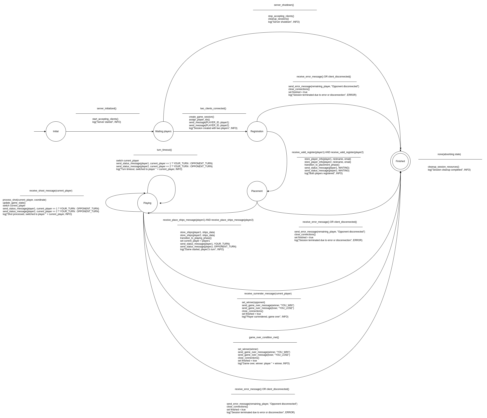

# Battle Ship Protocol
### Table of Contents
- [1. Introduction](#1-introduction)
  - [1.1 Purpose of the Document](#11-purpose-of-the-document)
  - [1.2 Project Overview](#12-project-overview)
  - [1.3 Scope and Objectives](#13-scope-and-objectives)
  - [1.4 Audience](#14-audience)
- [2. System Overview](#2-system-overview)
  - [2.1 High-Level Description of the Battleship Game](#21-high-level-description-of-the-battleship-game)
  - [2.2 Key Features and Functionality](#22-key-features-and-functionality)
  - [2.3 Assumptions and Constraints](#23-assumptions-and-constraints)
- [3. Requirements Analysis](#3-requirements-analysis)
- [4. Architecture Design](#4-architecture-design)
  - [4.1 Client-Server Model Overview](#41-client-server-model-overview)
  - [4.2 Component Diagram](#42-component-diagram)
  - [4.3 Protocol specification](#43-protocol-specification)
    - [4.3.1 Notational Conventions and Generic Grammar (BNF)](#431-notational-conventions-and-generic-grammar-bnf)
    - [4.3.2  Protocol Message Examples](#432-protocol-message-examples)
- [5. Detailed Design](#5-detailed-design)
  - [5.1 Class Diagram](#51-class-diagram)
  - [5.2 Concurrency Model](#52-concurrency-model)
  - [5.3 State Machine Diagram](#53-state-machine-diagram)
- [6. Implementation Details](#6-implementation-details)
  - [6.1 Development Environment](#61-development-environment)
  - [6.2 Tools and Libraries Used](#62-tools-and-libraries-used)
  - [6.3 Deployment Instructions](#63-deployment-instructions)
    - [6.3.1 Server Deployment](#631-server-deployment)
    - [6.3.2 Client Execution](#632-client-execution)
- [7. Testing and Validation](#7-testing-and-validation)
- [8. Video](#8-video)
- [9. Conclusion](#9-conclusion)


## 1. Introduction
### 1.1 Purpose of the Document
This document serves as the comprehensive design and implementation guide for the Battleship network programming project, developed as part of the ST0255 Telemática course. It outlines the system's architecture, technical specifications, and development process, providing a clear roadmap for stakeholders, including developers, instructors, and evaluators. The document details the client-server architecture, custom application-layer protocol, concurrency model, and testing strategy, ensuring alignment with the project's academic and technical objectives.

### 1.2 Project Overview
The Battleship project involves designing and implementing a multiplayer online version of the classic two-player strategy game, Batalla Naval, using the Berkeley Sockets API. The system comprises a server and a client, both implemented in C++. The server manages game sessions for multiple pairs of players, enforces game rules, and synchronizes state, while clients provide user interfaces for players to interact with the game. A custom text-based protocol facilitates communication over TCP/IP, enabling reliable data exchange. 

### 1.3 Scope and Objectives
The scope of the project includes:
- Deloping a server that handles multiple concurrent game sessions, validates player actions, and logs events.
- Creating a client application for player interaction, including registration, ship placement, and gameplay.
- Designing and implementing a text-based application-layer protocol for client-server communication.
- Deploying the server on an AWS Academy instance.
- Documenting the system design, implementation, and testing using UML diagrams and a README.md file

The objectives, as outlined in the project documentation, are to:
- Implement TCP/IP socket communication in a client-server architecture.
- Design and implement a custom application-layer protocol.
- Manage concurrency and multiple client connections on the server.
- Synchronize game states across clients.
- Apply data validation and error control in a distributed environment.
- Document the system and protocol comprehensively.

### 1.4 Audience
This document is intended for:
- Development Team: 

|  Name  |  GitHub  | LinkedIn   |
| ------------ | ------------ | ------------ |
| Samuel Andrés Ariza Gómez  | [samuelAriza](https://github.com/samuelAriza "samuelAriza")|  [Samuel Ariza Gómez](https://www.linkedin.com/in/samuel-ariza-g%C3%B3mez-84a12b293/ "Samuel Ariza Gómez") |
|  Andrés Vélez Rendón |  [AndresVelezR](https://github.com/AndresVelezR "AndresVelezR") |  [Andrés Vélez Rendón](https://www.linkedin.com/in/andres-velez-rendon-b5a499285/ "Andrés Vélez Rendón") |

- Instructors and Evaluators: Faculty members assessing the project against academic and technical criteria.

- Future Developers: Individuals who may extend or maintain the system, requiring insight into its design and implementation.


## 2. System Overview
### 2.1 High-Level Description of the Battleship Game
The Battleship game is a networked multiplayer implementation of the traditional two-player strategy game, Battleship. Players place a fleet of ships on a 10x10 grid, hidden from their opponent, and alternate shooting at the coordinates to sink the opponent's ships. The game progresses through three general phases: registration (registration of players with nickname and email), preparation (placement of ships), gameplay (turn-based shooting) and conclusion (when a player's fleet is completely sunk). Built on a client-server architecture, the system uses TCP/IP sockets for communication, with a central server managing game state and clients providing user interfaces. A custom text-based protocol ensures reliable data exchange between components.

### 2.2 Key Features and Functionality
The system supports the following features:
- Multiplayer Capability: Enables multiple pairs of players to engage in simultaneous game sessions.
- Client-Server Architecture:
	- Clients: Allow players to register, place ships, fire shots, and view game states (own and opponent boards).
	- Server: Manages client connections, pairs players, maintains game state, validates actions, and synchronizes updates.
- Custom Protocol: A text-based protocol defines message formats (`<message> ::= <message-type> "|" <message-data>`) for client-server communication.
- Concurrency: Utilizes threads to handle multiple client connections and game sessions concurrently.
- Turn Management: Enforces a 30-second turn limit to ensure timely gameplay.
- State Synchronization: Maintains consistent game states across clients, reflecting ship positions, shot outcomes (hit, miss, sunk), and turn status.
- Error and Disconnection Handling: Detects client disconnections, notifies affected players, and releases resources.
- Logging: Logs server events (e.g., connections, actions, errors) in a file with the format date time clientIP query response.
- Cloud Deployment: Runs the server on an AWS Academy instance for internet accessibility.

### 2.3 Assumptions and Constraints
Assumptions and limitations:
- Assumptions
	- Players maintain stable network connections, and the system handles disconnections gracefully.
	- The clients and server operate on platforms compatible with the Berkeley Sockets API.
	- Each game session involves exactly two players, matched by the server.
	- The game follows standard Battleship rules, with a fixed fleet configuration.
	- Sufficient system resources are available to support concurrent sessions.

- Restrictions
	- Implementation language: The server must be in C/C++ using the Berkeley Sockets API; clients may use any language that supports sockets.
	- Protocol: Must be text-based and run over TCP/IP.
	- Concurrency: The server must use threads for concurrent client management.
	- Implementation: The server must be deployed on AWS Academy.
	 Turn timer: Limit of 30 seconds per player turn, imposed by the server.
	- Messages: Messages must follow the specified format (`<message> ::= <message-type> "|" <message-data>`)

## 3. Requirements Analysis
For a detailed overview of the functional and non-functional requirements of this project, please refer to the project's backlog. It contains the full specification of features, user stories, and technical considerations.

🔗 [Click here to view the project backlog](https://github.com/users/samuelAriza/projects/4)

## 4. Architecture Design
### 4.1 Client-Server Model Overview

🔗 [Battleship Architecture (Deployment) Diagram](https://drive.google.com/drive/folders/13WqH-RQvgxA6bTyvapd2XzSNkvFG8cUw?usp=sharing)
### 4.2 Component Diagram 

🔗 [Battleship Component Diagram](https://drive.google.com/drive/folders/13WqH-RQvgxA6bTyvapd2XzSNkvFG8cUw?usp=sharing)
### 4.3 Protocol specification
#### 4.3.1 Notational Conventions and Generic Grammar (BNF)
The following BNF (Backus-Naur Form) defines the formal grammar for the communication protocol used in the client-server interaction of the Battleship game. This protocol is designed to ensure strict syntactic and semantic consistency across all message exchanges, enabling reliable parsing, validation, and processing of game-related instructions and states.

The BNF grammar below specifies all valid message types, their corresponding payloads, and the permissible structure and constraints of each component, including nicknames, coordinates, board states, and error reporting formats.

    <message> ::= <message-type> "|" <message-data>
    
    <message-type> ::= "REGISTER" 
                     | "PLACE_SHIPS" 
                     | "SHOOT" 
                     | "STATUS" 
                     | "SURRENDER" 
                     | "GAME_OVER" 
                     | "ERROR" 
                     | "PLAYER_ID"
    
    <message-data> ::= <empty-data> 
                     | <register-data> 
                     | <place-ships-data> 
                     | <shoot-data> 
                     | <status-data> 
                     | <surrender-data> 
                     | <game-over-data> 
                     | <error-data>
    
    <empty-data> ::= ""
    
    <register-data> ::= <nickname> "," <email>
    <nickname> ::= <string>
    <email> ::= <string> "@" <string> "." <string>
    
    <place-ships-data> ::= <ship-list>
    <ship-list> ::= <ship> | <ship> ";" <ship-list>
    <ship> ::= <ship-type> ":" <coordinates>
    <ship-type> ::= "PORTAAVIONES" 
                  | "BUQUE" 
                  | "CRUCERO" 
                  | "DESTRUCTOR" 
                  | "SUBMARINO"
    
    <coordinates> ::= <coord> | <coord> "," <coordinates> ","
    <coord> ::= <letter><number>
    <letter> ::= "A" | "B" | "C" | "D" | "E" | "F" | "G" | "H" | "I" | "J"
    <number> ::= "1" | "2" | "3" | "4" | "5" | "6" | "7" | "8" | "9" | "10"
    
    <shoot-data> ::= <coord>
    
    <status-data> ::= <turn> ";" <board-own> ";" <board-opponent> ";" <game-state> ";" <time-remaining>
    <turn> ::= "YOUR_TURN" | "OPPONENT_TURN"
    <board-own> ::= <cell-list>
    <board-opponent> ::= <cell-list>
    <cell-list> ::= <cell> | <cell> "," <cell-list>
    <cell> ::= <coord> ":" <cell-state>
    <cell-state> ::= "WATER" | "HIT" | "SUNK" | "SHIP"
    <game-state> ::= "ONGOING" | "WAITING" | "ENDED"
    <time-remaining> ::= <digit> | <digit> <number>
    
    <surrender-data> ::= ""
    
    <game-over-data> ::= <winner>
    <winner> ::= <nickname> | "NONE" | "YOU_WIN" | "YOU_LOSE"
    
    <error-data> ::= <error-code> "," <error-description>
    <error-code> ::= <digit><digit><digit>
    
    <digit> ::= "0" | "1" | "2" | "3" | "4" | "5" | "6" | "7" | "8" | "9"
    
    <error-description> ::= <string>
    <string> ::= <char> | <char><string>
    <char> ::= <letter> | <digit> | "_" | "-" | "."


#### 4.3.2 Protocol Message Examples
Below are example messages that conform strictly to the defined BNF grammar. These examples illustrate how each message type should be formatted and parsed during client-server communication.

- REGISTER:
Registers a new player in the system.
`REGISTER|john_doe,john.doe@example.com`
- PLACE_SHIPS:
Sends the player's ship configuration to the server.
`PLACE_SHIPS|PORTAAVIONES:A1,A5;BUQUE:B1,B3;CRUCERO:C1,C3;DESTRUCTOR:D1,D2;SUBMARINO:E1,E1`
- SHOOT:
Submits a shot to a specific coordinate on the opponent's board.
`SHOOT|F6`
- STATUS:
Retrieves the current game status including turn, board state (own board and opponent's board), and game state.
`STATUS|YOUR_TURN;A1:SHIP,A2:WATER,A3:HIT;B1:WATER,B2:HIT;ONGOING`
- SURRENDER:
Indicates that the player surrenders. This message carries no data.
`SURRENDER|`
- GAME_OVER:
Sent when the game ends, declaring the winner.
`GAME_OVER|john_doe`
Or if the game ends in a draw:
`GAME_OVER|NONE`
- ERROR:
Returns a structured error code and description.
`ERROR|404,Invalid coordinate provided`


## 5 Detailed Design
### 5.1 Class Diagram 

🔗 [UML Class Diagram](https://drive.google.com/drive/folders/13WqH-RQvgxA6bTyvapd2XzSNkvFG8cUw?usp=sharing)
### 5.2 Concurrency Model
#### Overview
The Battleship server is designed to facilitate multiple concurrent game sessions for pairs of players, using TCP sockets via the Berkeley Sockets API. The concurrency model employs threads to manage client connections, game sessions and cleanup tasks, ensuring efficient resource utilization through synchronization mechanisms to avoid race conditions and responsiveness. The model is robust and scalable, and fits the project requirements for concurrent multiplayer, state synchronization and error handling.

#### Threading Strategy
The server utilizes a hybrid threading model with dedicated threads for core server tasks and per-session threads for game logic. The following threads are employed:

- Main Thread:
	- Initializes the server (creates socket, binds to IP/port, sets up listening).
	- Spawns the acceptor and cleanup threads (`acceptor_thread` and `cleanup_thread`).
	- Joins these threads to wait for their completion, ensuring graceful shutdown.
- Acceptor Thread (`Server::accept_clients`):
	- Continuously accepts incoming client connections using `accept()`.
	- Queues client file descriptors (FDs) in a thread-safe queue (`pending_clients_`).
	- When two clients are queued, creates a `GameSession`, assigns clients as Player 1 and Player 2, and starts the session in a dedicated thread.
	- Synchronizes access to `pending_clients_ ` with `pending_mutex_`.
- Cleanup Thread (`Server::cleanup_finished_sessions`):
	- Periodically scans the `sessions_` map to remove finished game sessions (where `finished_ == true`).
	- Runs every 1 second to minimize lock contention, using `std::this_thread::sleep_for`.
	- Synchronizes access to `sessions_` with a mutex (`sessions_mutex_`).
- Session Threads (`GameSession::run_session`):
	- Each GameSession runs in its own thread (`session_thread_`), started via `GameSession::start`.
	- Manages the game lifecycle for a pair of players across phases: REGISTRATION, PLACEMENT, PLAYING, and FINISHED.
	- Handles client communication, processes messages (REGISTER, PLACE_SHIPS, SHOOT, SURRENDER), enforces game rules, and manages the 30-second turn timer.
	- Terminates when the game ends (via victory, surrender, or disconnection) or when an error occurs, `setting finished_ = true`.
#### Synchronization Mechanisms
To ensure thread safety and prevent race conditions, the following synchronization mechanisms are implemented:
- Mutexes:
    - `pending_mutex_`: Protects the `pending_clients_` queue during client enqueuing and dequeuing in `accept_clients`.
    - `sessions_mutex_`: Guards the `sessions_` map when adding new sessions or removing finished ones in `accept_clients` and `cleanup_finished_sessions`.
    - `log_mutex_`: Ensures thread-safe logging to the log file and console in `Server::log`, preventing interleaved writes.

- Thread-Safe Data Access:
    - The `pending_clients_` queue is only modified under `pending_mutex_` lock.
    - The `sessions_` map is accessed or modified under `sessions_mutex_` lock.
    - Within a `GameSession`, the `players_` map and game state (`game_`) are accessed exclusively by the session’s thread, eliminating the need for additional locks within the session.

- Atomic Operations:
    - The `running_` flag controls the acceptor and cleanup threads. It is written only during server shutdown and read by other threads, requiring no additional synchronization due to its single-write, multiple-read nature.

#### Turn Management and Timer
The 30-second turn limit is enforced during the PLAYING phase within each GameSession thread, as implemented in run_session. The implementation details are:
- Timer Mechanism:
	- The turn start time is recorded using t`urn_start_time_ = std::chrono::steady_clock::now()` at the beginning of each turn.
	- The `receive_messages` function uses `select()` with a 1-second timeout to check for incoming messages, allowing periodic checks of the elapsed time.
	- The elapsed time is calculated as `std::chrono::duration_cast<std::chrono::seconds>(now - turn_start_time_).count()`.
	- If the elapsed time exceeds `TURN_TIMEOUT_SECONDS` (30 seconds), the turn is skipped, and the turn switches to the other player.

- Turn Logic:
	- The `current_player` variable tracks the active player (1 or 2).
	- During a turn, the server waits for a SHOOT or SURRENDER message from the current player.
	- On a valid SHOOT, the server processes the shot, updates the game state, sends STATUS messages to both players (including the remaining time), and switches `current_player`.
	- On a SURRENDER, the server transitions to FINISHED, declares the opponent the winner, and sends GAME_OVER messages (YOU_WIN to the opponent, YOU_LOSE to the surrendering player).
	- On timeout, the server logs the event, switches `current_player`, updates `turn_start_time_`, and sends STATUS messages to reflect the new turn.
	- The `send_status` lambda calculates the remaining time (`time_remaining`) and includes it in STATUS messages during PLAYING, enabling clients to display a synchronized timer.

- Timeout Handling:
	- If a player exceeds 30 seconds without sending a valid SHOOT or SURRENDER, the `handle_timeout` lambda logs the event, switches the turn, and notifies both players with updated STATUS messages.
	- The game continues rather than terminating, ensuring fair play.

#### Handling Disconnections
Disconnections are detected in `receive_messages` when `recv() `returns 0 (client closed connection) or a negative value (error). The `handle_disconnect` lambda in run_session:
- Logs the disconnection event with the reason (e.g., "Client disconnected").
- Closes the disconnected player’s socket and marks their FD as -1.
- Notifies the remaining player with an ERROR message ("Opponent disconnected").
- Closes the remaining player’s socket and marks their FD as -1.
- Sets `finished_ = true`, allowing the cleanup thread to remove the session.

#### Handling Surrender
The SURRENDER message is processed in the PLAYING phase:
- When a SURRENDER message is received from the current player, the server:
	- Transitions the game to FINISHED via` game_->transition_to_finished()`.
	- Identifies the winner (the opponent) and loser (the surrendering player).
	- Sends a GAME_OVER message with YOU_WIN to the opponent and YOU_LOSE to the surrendering player.
	- Sets `finished_ = true` to terminate the session.
- The client provides an option to send SURRENDER (through a command line menu).

#### Concurrency Flow
1. Server Startup:
	- Main thread initializes the server, creates the socket, and spawns acceptor and cleanup threads.
2. Client Connection:
	- Acceptor thread accepts clients, queues FDs in `pending_clients_`, and creates a `GameSession` when two clients are available.
	- The session is started in a new thread and added to `sessions_`.
3. Game Sessions:
	- Session thread processes REGISTRATION (waits for REGISTER messages), PLACEMENT (waits for PLACE_SHIPS), and PLAYING (processes SHOOT or SURRENDER with a 30-second timer).
	- Sends STATUS messages to synchronize game state and timer.
	- Handles disconnections or surrenders, terminating the session when appropriate.
4. Cleanup:
	- Cleanup thread removes finished sessions from `sessions_` every second.
5. Shutdown:
	- Setting `running_ = false` stops the acceptor and cleanup threads.
	- Session threads terminate when games end or clients disconnect.

#### Error Handling
- Socket Errors: Handled by throwing `ServerError` or `ProtocolError`, logged, and communicated to clients (e.g., ERROR message with code 400).
- Thread Safety Violations: Prevented by mutexes and exclusive session-thread access to game state.
- Timeouts: Managed by skipping the turn and notifying clients, maintaining game continuity.
- Invalid Messages: Responded with ERROR messages (e.g., expecting SHOOT but receiving another type).
- Disconnections/Surrenders: Gracefully terminate the session and notify the remaining player.

#### Scalability Considerations
- The model supports multiple concurrent sessions, limited by system resources (threads, FDs).
- The cleanup thread ensures timely resource reclamation.
- For high loads, a thread pool could be considered, but the current model is sufficient for the project’s scope (multiple pairs of players).

### 5.3 State Machine Diagram
This section presents the Finite State Machines (FSMs) for the server and client components of the Battleship game, designed to provide a clear and concise representation of their overall operational flow. The main objective is to illustrate the high-level structure and control of the game phases, capturing the logical progression of interactions between the server, clients, and players, as defined by the designed Battleship game protocol.

The server FSM describes the lifecycle of a game session, detailing the management of player registration, ship placement, gameplay, and session termination, including the handling of client disconnections. The client FSM complements this information by describing the client’s behavior, including user interactions, responses to server messages, and the end-of-game menu that allows players to start a new game or exit. Together, these FSMs provide a comprehensive view of the game’s flow from start to finish, emphasizing protocol-driven state transitions and user-driven actions.

These finite state machines abstract low-level details of the network connection, such as those related to the socket API (e.g., socket creation, binding, or message transmission). Instead, they focus on the logical flow of game states, the events that trigger state transitions (e.g., protocol messages, user inputs, timeouts, or disconnections), and the corresponding actions (e.g., sending messages, updating game state, displaying boards, or presenting menus). This approach ensures that the FSMs remain accessible and focused tools for understanding the core functionality of the Battleship server and client.

#### Server Finite State Machine

🔗 [FSM Server](https://drive.google.com/drive/folders/13WqH-RQvgxA6bTyvapd2XzSNkvFG8cUw?usp=sharing)


#### Client Finite State Machine

🔗 [FSM Server](https://drive.google.com/drive/folders/13WqH-RQvgxA6bTyvapd2XzSNkvFG8cUw?usp=sharing)


## 6 Implementation Details
### 6.1 Development Environment
- Operating Systems:
	- Development:  Kali GNU/Linux Rolling
	- Deployment: AWS EC2 (Instance for server deployment)
- Hardware:

| Component  | Specification   |
| ------------ | ------------ |
| Laptop Model  | Acer Aspire A315-58  |
|  Processor | Intel® Core™ i5-1135G7 (11th Gen, 4 cores / 8 threads, up to 4.2 GHz) |
| Architecture  | 64-bit |
| RAM  | 8 GB DDR4 (2× 4GB @ 3200 MHz, Dual Channel: SK Hynix + Micron) |
| Storage  |  512 GB NVMe SSD (WDC PC SN530) |
| Wireless  |  Intel Wi-Fi 6 AX201 + Bluetooth |
| Ethernet  | Realtek PCIe Gigabit Ethernet Controller |
| OS |  Linux (kernel 6.12.20-amd64 |

### 6.2 Tools and Libraries Used
The following tools and libraries were utilized to develop, test, and deploy the Battleship game:
- Compilers:
	- g++ (Debian 14.2.0-19) 14.2.0
- Build Tools:
	- cmake version 3.31.6 and GNU Make 4.4.1 (for automating compilation of server and client executables).
- Version Control:
	- git version 2.47.2
- Testing and Debugging:
	- Google Test was used for writing and running unit tests across the following core modules: game logic, protocol and phase state).
- Documentation Tools:
	- Markdown for README.md and documentation.
	- [Draw.io](https://app.diagrams.net/ "Draw.io") for generating UML diagrams.

### 6.3 Deployment Instructions
#### 6.3.1 Server Deployment
To deploy the C++ server on an AWS EC2 instance provided by AWS Academy, follow these steps:
1. Launch EC2 Instance:
	- Log in to AWS Academy and access the EC2 dashboard. 
	- Launch a t2.micro instance with Ubuntu Server 24.04 LTS.
	- Configure the security group to allow TCP traffic on port 8080.
2. Install Dependencies:
	- Connect to the instance via SSH.
	- Update the system and install GCC for C++, CMake and Make for automating compilation:
      ```bash
      sudo apt update -y
      sudo apt install -y gcc-c++ make git
      ```
3. Clone the repository:
      ```bash
      git clone git@github.com:samuelAriza/BattleShip.git
      ```
4. Compile and Run:

   - Go to the following path:

     ```bash
     cd BattleShip/build
     ```

   - Execute the following commands:

     ```bash
     cmake ..
     make
     ```

   - Run the server, specifying the IP, port, and log file:

     ```bash
     ./server 0.0.0.0 8080 /home/ec2-user/log.log
     ```
5. Verify Deployment:
	- Confirm the server is running by checking the console output or log file.
#### 6.3.2 Client Execution

To run the C++ client locally, follow these steps:

1. Set Up Environment:  
   - Ensure `g++` (Debian 14.2.0-19) 14.2.0 or compatible is installed on the local machine.

2. Compile the Client:  
   - Compile the client code using a provided Makefile or directly:

     ```bash
     g++ -o client client.cpp -std=c++17
     ```
3. Run the Client:
   - Execute the client, specifying the path log:

     ```bash
     ./bsclient </path/log.log>
     ```


## 7 Testing and Validation
This project includes comprehensive automated testing using Google Test. The tests are divided into unit, integration, and system-level checks to ensure full coverage of the core components.
### Test Plan
| Test Level  | Description  |
| ------------ | ------------ |
| Unit Test  |Validate isolated components like `GameLogic`, `Protocol`, and `PhaseState`. |
|  Integration | Ensure communication between game states, message parsing, and transitions. |
|  System Tests	 | Simulate complete game flows, including player registration and shooting. |

#### Unit Test
`game_logic_test.cpp`
- Tests the core mechanics of player registration, ship placement, and turn-based gameplay.
- Ensures exception handling when registering invalid players or placing incorrect ships.
- Validates win conditions and game over behavior.

##### Sample test cases:
- `RegisterPlayer_Player1_Success`
- `PlaceShips_TooFewShips_Throws`
- `ProcessShot_ChangesTurn`

```bash
./game_logic_test
[==========] Running 13 tests from 1 test suite.
[----------] Global test environment set-up.
[----------] 13 tests from GameLogicTest
[ RUN      ] GameLogicTest.RegisterPlayer_Player1_Success
[       OK ] GameLogicTest.RegisterPlayer_Player1_Success (0 ms)
[ RUN      ] GameLogicTest.RegisterPlayer_Player2_Success
[       OK ] GameLogicTest.RegisterPlayer_Player2_Success (0 ms)
[ RUN      ] GameLogicTest.RegisterPlayer_InvalidPlayerId_Throws
[       OK ] GameLogicTest.RegisterPlayer_InvalidPlayerId_Throws (0 ms)
[ RUN      ] GameLogicTest.RegisterPlayer_DuplicateRegistration_Throws
[       OK ] GameLogicTest.RegisterPlayer_DuplicateRegistration_Throws (0 ms)
[ RUN      ] GameLogicTest.RegisterPlayer_EmptyNickname_AllowsByDefault
[       OK ] GameLogicTest.RegisterPlayer_EmptyNickname_AllowsByDefault (0 ms)
[ RUN      ] GameLogicTest.PlaceShips_ValidForPlayer1_Succeeds
[       OK ] GameLogicTest.PlaceShips_ValidForPlayer1_Succeeds (0 ms)
[ RUN      ] GameLogicTest.PlaceShips_InvalidPlayerId_Throws
[       OK ] GameLogicTest.PlaceShips_InvalidPlayerId_Throws (0 ms)
[ RUN      ] GameLogicTest.PlaceShips_DuplicatePlacement_Throws
[       OK ] GameLogicTest.PlaceShips_DuplicatePlacement_Throws (0 ms)
[ RUN      ] GameLogicTest.PlaceShips_PlayersNotRegistered_Throws
[       OK ] GameLogicTest.PlaceShips_PlayersNotRegistered_Throws (0 ms)
[ RUN      ] GameLogicTest.PlaceShips_TooFewShips_Throws
[       OK ] GameLogicTest.PlaceShips_TooFewShips_Throws (0 ms)
[ RUN      ] GameLogicTest.ProcessShot_ValidHit_Player1_Succeeds
[       OK ] GameLogicTest.ProcessShot_ValidHit_Player1_Succeeds (0 ms)
[ RUN      ] GameLogicTest.ProcessShot_ChangesTurn
[       OK ] GameLogicTest.ProcessShot_ChangesTurn (0 ms)
[ RUN      ] GameLogicTest.ProcessShot_InvalidCoordinate_Throws
[       OK ] GameLogicTest.ProcessShot_InvalidCoordinate_Throws (0 ms)
[----------] 13 tests from GameLogicTest (1 ms total)

[----------] Global test environment tear-down
[==========] 13 tests from 1 test suite ran. (1 ms total)
[  PASSED  ] 13 tests.
```

`phase_state_test.cpp`
- Validates state transitions in the game phase (registration → placement → playing → finished).
- Ensures illegal transitions throw appropriate exceptions.

##### Sample test cases:
- `TransitionFromRegistrationToPlacement`
- `InvalidTransitionFromPlacementToFinished`
- `FullTransitionCycle`

```bash
./phase_state_test  
[==========] Running 7 tests from 1 test suite.
[----------] Global test environment set-up.
[----------] 7 tests from PhaseStateTest
[ RUN      ] PhaseStateTest.TransitionFromRegistrationToPlacement
[       OK ] PhaseStateTest.TransitionFromRegistrationToPlacement (0 ms)
[ RUN      ] PhaseStateTest.InvalidTransitionFromRegistrationToPlaying
[       OK ] PhaseStateTest.InvalidTransitionFromRegistrationToPlaying (0 ms)
[ RUN      ] PhaseStateTest.TransitionFromPlacementToPlaying
[       OK ] PhaseStateTest.TransitionFromPlacementToPlaying (0 ms)
[ RUN      ] PhaseStateTest.InvalidTransitionFromPlacementToFinished
[       OK ] PhaseStateTest.InvalidTransitionFromPlacementToFinished (0 ms)
[ RUN      ] PhaseStateTest.TransitionFromPlayingToFinished
[       OK ] PhaseStateTest.TransitionFromPlayingToFinished (0 ms)
[ RUN      ] PhaseStateTest.FullTransitionCycle
[       OK ] PhaseStateTest.FullTransitionCycle (0 ms)
[ RUN      ] PhaseStateTest.InvalidMultipleTransitionsToSamePhase
[       OK ] PhaseStateTest.InvalidMultipleTransitionsToSamePhase (0 ms)
[----------] 7 tests from PhaseStateTest (0 ms total)

[----------] Global test environment tear-down
[==========] 7 tests from 1 test suite ran. (0 ms total)
[  PASSED  ] 7 tests.
```

`protocol_test.cpp`
- Exhaustively tests the `Protocol` class's ability to parse and build messages.
- Covers valid/invalid cases for REGISTER, PLACE_SHIPS, SHOOT, SURRENDER, STATUS, GAME_OVER, and ERROR.

##### Sample test cases:
- `ParseMessage_RegisterData_ParsesCorrectly`
- `ParseMessage_Shoot_InvalidFormat_NumberFirst`
- `BuildMessage_GameOver`

```bash
./protocol_test             
[==========] Running 51 tests from 1 test suite.
[----------] Global test environment set-up.
[----------] 51 tests from ProtocolTest
[ RUN      ] ProtocolTest.ParseMessage_PlayerIdData
[       OK ] ProtocolTest.ParseMessage_PlayerIdData (0 ms)
[ RUN      ] ProtocolTest.ParseMessage_RegisterData_ParsesCorrectly
[       OK ] ProtocolTest.ParseMessage_RegisterData_ParsesCorrectly (0 ms)
[ RUN      ] ProtocolTest.ParseMessage_Register_MissingCommaThrows
[       OK ] ProtocolTest.ParseMessage_Register_MissingCommaThrows (10 ms)
[ RUN      ] ProtocolTest.ParseMessage_Register_EmptyNicknameThrows
[       OK ] ProtocolTest.ParseMessage_Register_EmptyNicknameThrows (0 ms)
[ RUN      ] ProtocolTest.ParseMessage_Register_EmptyEmailThrows
[       OK ] ProtocolTest.ParseMessage_Register_EmptyEmailThrows (0 ms)
[ RUN      ] ProtocolTest.ParseMessage_Register_EmptyDataThrows
[       OK ] ProtocolTest.ParseMessage_Register_EmptyDataThrows (0 ms)
[ RUN      ] ProtocolTest.ParseMessage_Register_MissingBothFieldsThrows
[       OK ] ProtocolTest.ParseMessage_Register_MissingBothFieldsThrows (0 ms)
[ RUN      ] ProtocolTest.ParseMessage_Register_MissingDelimiterThrows
[       OK ] ProtocolTest.ParseMessage_Register_MissingDelimiterThrows (0 ms)
[ RUN      ] ProtocolTest.ParseMessage_PlaceShips_ParsesCorrectly
[       OK ] ProtocolTest.ParseMessage_PlaceShips_ParsesCorrectly (0 ms)
[ RUN      ] ProtocolTest.ParseMessage_PlaceShips_InvalidFormat_NoColon
[       OK ] ProtocolTest.ParseMessage_PlaceShips_InvalidFormat_NoColon (0 ms)
[ RUN      ] ProtocolTest.ParseMessage_PlaceShips_InvalidFormat_NoComma
[       OK ] ProtocolTest.ParseMessage_PlaceShips_InvalidFormat_NoComma (0 ms)
[ RUN      ] ProtocolTest.ParseMessage_PlaceShips_EmptyData
[       OK ] ProtocolTest.ParseMessage_PlaceShips_EmptyData (0 ms)
[ RUN      ] ProtocolTest.ParseMessage_PlaceShips_InvalidShipType
[       OK ] ProtocolTest.ParseMessage_PlaceShips_InvalidShipType (0 ms)
[ RUN      ] ProtocolTest.ParseMessage_PlaceShips_InvalidCoordinate
[       OK ] ProtocolTest.ParseMessage_PlaceShips_InvalidCoordinate (0 ms)
[ RUN      ] ProtocolTest.ParseMessage_PlaceShips_DuplicateShipTypesAllowed
[       OK ] ProtocolTest.ParseMessage_PlaceShips_DuplicateShipTypesAllowed (0 ms)
[ RUN      ] ProtocolTest.ParseMessage_Shoot_ValidCoordinates
[       OK ] ProtocolTest.ParseMessage_Shoot_ValidCoordinates (0 ms)
[ RUN      ] ProtocolTest.ParseMessage_PlaceShips_EmptyMessageThrows
[       OK ] ProtocolTest.ParseMessage_PlaceShips_EmptyMessageThrows (0 ms)
[ RUN      ] ProtocolTest.ParseMessage_PlaceShips_MissingDataThrows
[       OK ] ProtocolTest.ParseMessage_PlaceShips_MissingDataThrows (0 ms)
[ RUN      ] ProtocolTest.ParseMessage_PlaceShips_SingleShip
[       OK ] ProtocolTest.ParseMessage_PlaceShips_SingleShip (0 ms)
[ RUN      ] ProtocolTest.ParseMessage_Shoot_EmptyCoordinate
[       OK ] ProtocolTest.ParseMessage_Shoot_EmptyCoordinate (0 ms)
[ RUN      ] ProtocolTest.ParseMessage_Shoot_MissingDelimiter
[       OK ] ProtocolTest.ParseMessage_Shoot_MissingDelimiter (0 ms)
[ RUN      ] ProtocolTest.ParseMessage_Shoot_InvalidFormat_NumberFirst
[       OK ] ProtocolTest.ParseMessage_Shoot_InvalidFormat_NumberFirst (0 ms)
[ RUN      ] ProtocolTest.ParseMessage_Shoot_IncompleteCoordinate_OnlyLetter
[       OK ] ProtocolTest.ParseMessage_Shoot_IncompleteCoordinate_OnlyLetter (0 ms)
[ RUN      ] ProtocolTest.ParseMessage_Shoot_IncompleteCoordinate_OnlyNumber
[       OK ] ProtocolTest.ParseMessage_Shoot_IncompleteCoordinate_OnlyNumber (0 ms)
[ RUN      ] ProtocolTest.ParseMessage_Shoot_InvalidCoordinateSymbols
[       OK ] ProtocolTest.ParseMessage_Shoot_InvalidCoordinateSymbols (0 ms)
[ RUN      ] ProtocolTest.ParseMessage_Surrender
[       OK ] ProtocolTest.ParseMessage_Surrender (0 ms)
[ RUN      ] ProtocolTest.ParseMessage_Status_LongMessage_ParsesCorrectly
[       OK ] ProtocolTest.ParseMessage_Status_LongMessage_ParsesCorrectly (0 ms)
[ RUN      ] ProtocolTest.ParseMessage_Status_ParsesCorrectly
[       OK ] ProtocolTest.ParseMessage_Status_ParsesCorrectly (0 ms)
[ RUN      ] ProtocolTest.ParseMessage_Status_OpponentTurn
[       OK ] ProtocolTest.ParseMessage_Status_OpponentTurn (0 ms)
[ RUN      ] ProtocolTest.ParseMessage_StatusWithEmptyBoards_ParsesCorrectly
[       OK ] ProtocolTest.ParseMessage_StatusWithEmptyBoards_ParsesCorrectly (0 ms)
[ RUN      ] ProtocolTest.ParseMessage_Status_MultipleCells
[       OK ] ProtocolTest.ParseMessage_Status_MultipleCells (0 ms)
[ RUN      ] ProtocolTest.ParseMessage_Status_InvalidFormat
[       OK ] ProtocolTest.ParseMessage_Status_InvalidFormat (0 ms)
[ RUN      ] ProtocolTest.ParseMessage_GameOver_ParsesCorrectlyWithStandardName
[       OK ] ProtocolTest.ParseMessage_GameOver_ParsesCorrectlyWithStandardName (0 ms)
[ RUN      ] ProtocolTest.ParseMessage_GameOver_ParsesCorrectlyWithNameContainingSpaces
[       OK ] ProtocolTest.ParseMessage_GameOver_ParsesCorrectlyWithNameContainingSpaces (0 ms)
[ RUN      ] ProtocolTest.ParseMessage_GameOver_ParsesWinnerWithSpecialChars
[       OK ] ProtocolTest.ParseMessage_GameOver_ParsesWinnerWithSpecialChars (0 ms)
[ RUN      ] ProtocolTest.ParseMessage_GameOver_ParsesCorrectlyWithEmptyWinner
[       OK ] ProtocolTest.ParseMessage_GameOver_ParsesCorrectlyWithEmptyWinner (0 ms)
[ RUN      ] ProtocolTest.ParseMessage_GameOver_ThrowsOnMissingPipeSeparator
[       OK ] ProtocolTest.ParseMessage_GameOver_ThrowsOnMissingPipeSeparator (0 ms)
[ RUN      ] ProtocolTest.ParseMessage_GameOver_ThrowsOnExtraData
[       OK ] ProtocolTest.ParseMessage_GameOver_ThrowsOnExtraData (0 ms)
[ RUN      ] ProtocolTest.ParseMessage_Error_ParsesCorrectly
[       OK ] ProtocolTest.ParseMessage_Error_ParsesCorrectly (0 ms)
[ RUN      ] ProtocolTest.ParseMessage_Error_NonNumericCodeThrows
[       OK ] ProtocolTest.ParseMessage_Error_NonNumericCodeThrows (0 ms)
[ RUN      ] ProtocolTest.ParseMessage_Error_MissingCommaThrows
[       OK ] ProtocolTest.ParseMessage_Error_MissingCommaThrows (0 ms)
[ RUN      ] ProtocolTest.ParseMessage_Error_EmptyDescriptionThrows
[       OK ] ProtocolTest.ParseMessage_Error_EmptyDescriptionThrows (0 ms)
[ RUN      ] ProtocolTest.ParseMessage_Error_EmptyCodeThrows
[       OK ] ProtocolTest.ParseMessage_Error_EmptyCodeThrows (0 ms)
[ RUN      ] ProtocolTest.ParseMessage_Error_EmptyDataThrows
[       OK ] ProtocolTest.ParseMessage_Error_EmptyDataThrows (0 ms)
[ RUN      ] ProtocolTest.BuildMessage_Register_ReturnsCorrectFormat
[       OK ] ProtocolTest.BuildMessage_Register_ReturnsCorrectFormat (0 ms)
[ RUN      ] ProtocolTest.BuildMessage_PlaceShips
[       OK ] ProtocolTest.BuildMessage_PlaceShips (0 ms)
[ RUN      ] ProtocolTest.BuildMessage_Shoot
[       OK ] ProtocolTest.BuildMessage_Shoot (0 ms)
[ RUN      ] ProtocolTest.BuildMessage_Status
[       OK ] ProtocolTest.BuildMessage_Status (0 ms)
[ RUN      ] ProtocolTest.BuildMessage_Surrender
[       OK ] ProtocolTest.BuildMessage_Surrender (0 ms)
[ RUN      ] ProtocolTest.BuildMessage_GameOver
[       OK ] ProtocolTest.BuildMessage_GameOver (0 ms)
[ RUN      ] ProtocolTest.BuildMessage_Error
[       OK ] ProtocolTest.BuildMessage_Error (0 ms)
[----------] 51 tests from ProtocolTest (11 ms total)

[----------] Global test environment tear-down
[==========] 51 tests from 1 test suite ran. (11 ms total)
[  PASSED  ] 51 tests.
```

### Integration Test:
- Implicitly covered by combining message parsing (protocol) with game_logic in the Server.
- Validates if parsed inputs (e.g., PLACE_SHIPS) are interpreted correctly during gameplay.
- Validation: Message parsing and in-game execution behave consistently.\

### System Tests
Result


## 8 Video

## 9 Conclusion